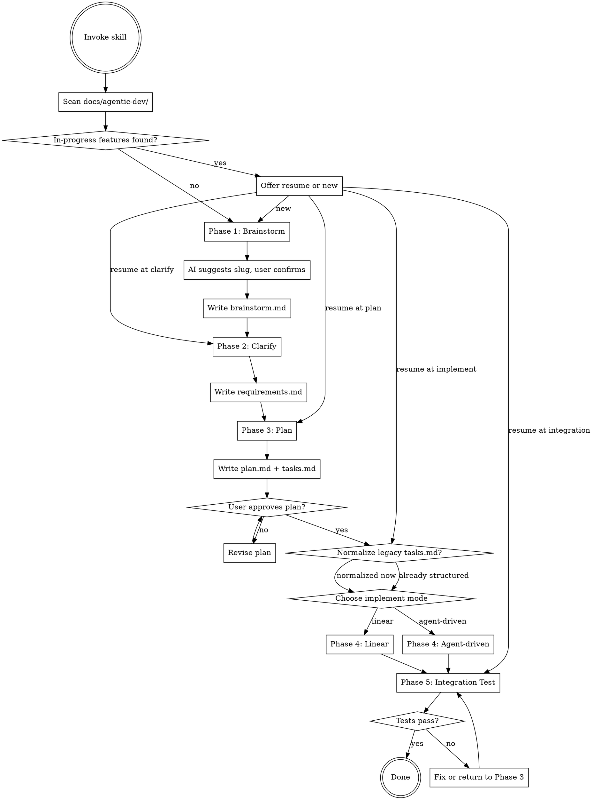

# Agentic Dev Workflow

Use this skill for a persisted, multi-phase feature workflow:
**brainstorm -> clarify -> plan -> implement -> Integration Test**.

Artifacts live in `docs/agentic-dev/{feature-slug}/` so later sessions can resume deterministically instead of reconstructing state from memory.

## When to Use

- Starting a new feature that needs structured discovery before coding
- Resuming a partially completed feature from saved artifacts
- Requiring explicit user approval before implementation begins
- Needing to choose between linear execution and one-subagent-per-task execution

## When Not to Use

- Exploratory questions that only ask to understand existing code or behavior, without starting feature work
- Pure research tasks that do not produce a feature plan
- Cases where implementation is already complete and only code review is needed

## Checklist

You MUST complete these steps in order:

1. **Resume check** — scan `docs/agentic-dev/` for in-progress features
2. **Phase 1: Brainstorm** — explore the idea, confirm feature slug, write `brainstorm.md`
3. **Phase 2: Clarify** — ask requirements questions one-by-one, write `requirements.md`
4. **Phase 3: Plan** — create `plan.md` + `tasks.md`, get hard-gate user approval
5. **Phase 4: Implement** — user chooses Linear or Agent-driven mode, execute all tasks
6. **Phase 5: Integration Test** — run full test suite, summarize results

## Process Flow



---

## Resume Logic

When skill is invoked, scan `docs/agentic-dev/` for existing feature folders:

```bash
ls docs/agentic-dev/ 2>/dev/null
```

For each folder found, detect phase by artifact presence:

| Artifacts present | Resume at |
|-------------------|-----------|
| `brainstorm.md` only | Phase 2: Clarify |
| `brainstorm.md` + `requirements.md` | Phase 3: Plan |
| `brainstorm.md` + `requirements.md` + `plan.md` + `tasks.md` | Phase 4: Implement (normalize first if legacy format) |
| All tasks in `tasks.md` show `Status: done` | Phase 5: Integration Test |

If in-progress features found, present them:
> *"Found in-progress feature `user-auth` at Plan phase. Resume this, or start a new feature?"*

If user chooses resume, skip completed phases and continue from detected phase.

Phase 5 eligibility is determined by parsing task statuses in `tasks.md`; no separate integration artifact is required.

**Phase 4 resume rules:**
- Reset any `Status: in_progress` task to `Status: pending` — they were interrupted and must restart
- Keep `Status: done` tasks as done
- Keep `Status: blocked` tasks as blocked
- Always re-ask user for implementation mode (Linear or Agent-driven) — do not infer from previous session
- Resume from the first task with `Status: pending`

---

## Phase 1: Brainstorm

**Goal:** Understand the problem, goal, and context freely. No scope constraints.

**Process:**
1. Ask open-ended questions to understand what the user wants to build:
   - What problem does this solve?
   - Who uses this? What do they do with it?
   - Any existing systems or constraints to be aware of?
2. Continue asking until you have a clear picture of the problem space.
3. Summarize your understanding and ask user to confirm.
4. Suggest a kebab-case feature slug derived from the feature title (e.g., `user-auth`, `payment-flow`, `csv-export`). Ask user to confirm or change.
   - Slug must contain only lowercase letters, numbers, and hyphens. Reject slugs with spaces, slashes, dots, or other special characters.
5. Create folder: `docs/agentic-dev/{slug}/`
6. Write `docs/agentic-dev/{slug}/brainstorm.md`:

```markdown
# Brainstorm — {feature-slug}

## Problem
{what problem this solves}

## Goal
{what we want to build}

## Context
{existing systems, constraints, stakeholders}

## Open Questions
{anything still unclear}
```

---

## Phase 2: Clarify

**Goal:** Nail down requirements, constraints, and definition of done.

**Rules:**
- Ask **one question at a time**. Never multiple questions in one message.
- Prefer multiple choice questions. Open-ended only when necessary.
- Cover: tech stack, platform, constraints, success criteria, out-of-scope (YAGNI).

**Process:**
1. Read `brainstorm.md` to understand context.
2. Ask clarifying questions one-by-one until you have clear answers for:
   - Tech stack / language / framework
   - Target platform (web, CLI, mobile, etc.)
   - Key constraints (performance, compatibility, deadlines)
   - Success criteria: what does "done" look like?
   - Explicit out-of-scope: what are we NOT building?
3. Summarize requirements and ask user to confirm.
4. Write `docs/agentic-dev/{slug}/requirements.md`:

```markdown
# Requirements — {feature-slug}

## Tech Stack
{language, framework, key libraries}

## Platform
{where this runs}

## Constraints
{performance, compatibility, other constraints}

## Success Criteria
{definition of done — how we know it's working}

## Out of Scope
{explicitly excluded — YAGNI}
```

---

## Phase 3: Plan

**Goal:** Produce a structured plan with tasks that the implement phase can execute directly.

**Process:**
1. Read `requirements.md` thoroughly.
2. Design the architecture and component breakdown.
3. Write `docs/agentic-dev/{slug}/plan.md`:

```markdown
# Plan — {feature-slug}

## Approach
{overall technical approach, 2-3 sentences}

## Architecture
{components, their responsibilities, how they connect}

## Components
### Component: {name}
- Responsibility:
- Depends on:
- Interface:

## File Structure
- Create: `path`
- Modify: `path`

## Test Strategy
- Unit:
- Integration:

## Execution Notes
- Risks:
- Ordering constraints:
```

4. Write `docs/agentic-dev/{slug}/tasks.md` using this format:

```markdown
# Tasks — {feature-slug}

## Task: TASK-01
- Status: pending
- Component: auth-service
- Depends on: none
- Files:
  - `src/auth.ts`
  - `tests/auth.test.ts`
- Acceptance Criteria:
  - rejects empty token
  - returns user for valid token
```

Task status values:
- `pending`
- `in_progress`
- `done`
- `blocked`

Task rules:
- Each task must be independently implementable
- Tasks ordered by dependency (no task depends on a later task)
- Each task should take 15–60 minutes to implement
- Each task must list exact files and acceptance criteria
- If resuming from a legacy checklist-based `tasks.md`, normalize it into this structure before entering Implement

5. Present plan.md and tasks.md to user section by section.
6. **HARD GATE:** Do not proceed to Phase 4 until user explicitly approves the plan.
   - If user requests changes: update plan.md and/or tasks.md, present again.
   - Repeat until user says OK / approved / looks good.

---

## Phase 4: Implement

**Goal:** Implement all tasks from `tasks.md`, with per-task tests.

At the start of Phase 4, ask user:
> *"Ready to implement. Choose mode:*
> *A. Linear — I implement tasks sequentially with auto-review (no subagents)*
> *B. Agent-driven — I dispatch one subagent per task*
> *Which do you prefer?"*

### Linear Mode

Implement tasks in order. For each task:

1. Set the current task's `Status` to `in_progress`.
2. Write failing tests first (TDD).
3. Implement minimal code to pass tests.
4. Run tests — verify pass.
5. Auto-review: verify tests pass + check implementation matches the task's acceptance criteria and file list.
6. Set the task's `Status` to `done`.
7. Commit: `git commit -m "feat: implement {task-id} — {task-description}"`
8. Move to next task.

**Dependency Safety:**
A task is **dependency-safe** if:
- Its `Depends on` field is `none`, OR
- All task IDs listed in its `Depends on` field have `Status: done`

When a task is blocked, check later tasks against this rule before proceeding.

**Rules:**
- Do NOT pause between tasks. Execute all tasks without stopping.
- The only reason to stop: ambiguity that genuinely prevents progress and cannot be resolved by skipping.
- If a task is blocked: set `Status: blocked`, record the reason inline under that task, skip it, continue with the next dependency-safe task, and report all blocked tasks at end.

### Agent-driven Mode

For each task:

1. Set the current task's `Status` to `in_progress`.
2. Read `.agent/skills/agentic-dev-workflow/implementer-prompt.md`.
3. Dispatch a subagent with constructed context (see `implementer-prompt.md` for template).
   - Subagent receives: full `requirements.md` + `plan.md` + the full structured task block + commit instructions
   - Subagent does NOT inherit your session history
4. Subagent implements + writes tests + self-reviews + commits.
5. Review subagent output:
   - If subagent reports **DONE**: set the task's `Status` to `done`.
6. If subagent reports **DONE_WITH_CONCERNS**: read the concerns before continuing. If they affect correctness or scope, address them. Then set the task's `Status` to `done`.
7. If subagent reports **NEEDS_CONTEXT**: provide the missing context and re-dispatch.
8. If subagent reports **BLOCKED**: set the task's `Status` to `blocked`, record the reason inline, and continue to the next dependency-safe task.
9. If subagent fails with errors (not BLOCKED):
   - Retry once with additional context explaining what failed and why.
   - If fails again: fallback to Linear mode for this task only. Continue normally.
10. Move to next task.

**Rules:**
- Do NOT pause between tasks. Dispatch next subagent immediately after reviewing previous result.
- Subagent failure fallback to linear is silent — no need to inform user unless all retries exhausted.

---

## Phase 5: Integration Test

**Goal:** Verify end-to-end functionality across all implemented tasks.

**Process:**
1. Detect the test runner from `requirements.md` (Tech Stack section) or by scanning project root:
   - `package.json` present → `npm test`
   - `pytest.ini`, `setup.py`, or `pyproject.toml` present → `pytest`
   - `go.mod` present → `go test ./...`
   - `Cargo.toml` present → `cargo test`
   Run the detected test suite.
2. Check end-to-end flows described in `requirements.md` success criteria.
3. Report results:
   - How many tests passed / failed
   - Which tasks had failing tests
   - Code coverage if available
4. If tests fail:
   - Diagnose root cause.
   - Fix without pausing — apply fixes directly.
   - If fix requires changing architecture or task breakdown: update `plan.md` and `tasks.md`, return to Phase 3 for re-approval.
   - Re-run integration tests after fixes.
5. When all tests pass: summarize what was built and next steps.

---

## Error Handling

| Situation | Behavior |
|-----------|----------|
| Task blocked (missing dep, unclear spec) | Set `Status: blocked`, record the reason inline in the task block, skip the task, continue with the next dependency-safe task, and report blocked tasks at end of Phase 4. |
| Subagent reports `NEEDS_CONTEXT` | Provide the missing context and re-dispatch the same task. |
| Subagent fails twice with execution errors | Fallback to Linear mode for that task only. Continue normally. |
| Integration tests fail | Diagnose + fix inline. If fix needs plan change, return to Phase 3. |
| Session interrupted mid-phase | On next invocation, resume check detects the current phase, resets any `in_progress` task to `pending`, normalizes legacy tasks if needed, and resumes from the correct point. |

---

## Key Principles

1. **One question at a time** — Clarify phase never asks multiple questions at once.
2. **Artifact-first** — Write files before transitioning phases. Never hold state only in memory.
3. **YAGNI ruthlessly** — In Plan phase, remove anything not explicitly required.
4. **Hard gate before Implement** — User must approve plan. No auto-proceed.
5. **Continuous execution in Implement** — No pausing between tasks in either mode.
6. **Subagent isolation** — Agent-driven subagents receive constructed context only, never inherit session history.
7. **Graceful degradation** — Agent-driven failure falls back to linear, not to a stop.
